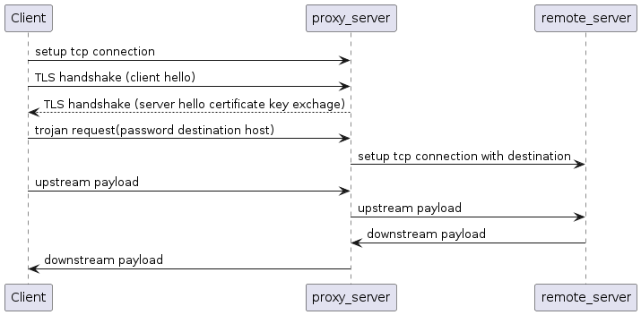

# Overplus

A lightweight, high-performance C++17 proxy server supporting Trojan, SOCKS5, HTTPS, and a custom V-Protocol.

## Performance

Measured on a 2-core Xeon Skylake / 2GB RAM / Ubuntu 24.04:

| Metric | Value |
|--------|-------|
| Concurrent connections | **146** |
| Memory (146 conns) | **25 MB** |
| Memory per connection | **~170 KB** |
| CPU utilization | **< 1%** |
| TLS reconnect | **< 1ms** (session reuse) |
| DNS resolution | **0ms** (cached after first lookup) |

### Why so fast?

- **SSL Session Reuse** — Clients reconnect in <1ms by resuming the TLS session, skipping the full handshake (certificate exchange + key negotiation).
- **TCP DNS Cache** — DNS results are cached globally for 10 minutes (configurable). Repeated connections to the same domain skip DNS resolution entirely.
- **64KB Buffers** — Larger read/write buffers reduce system call frequency while keeping memory usage low.
- **Static Linking** — Boost & OpenSSL statically linked. Zero runtime dependencies, no shared library conflicts.

## Comparison

| | Overplus | Trojan-Go | V2Ray/Xray |
|---|---|---|---|
| Language | C++17 | Go | Go |
| Memory (100 conns) | **~20 MB** | ~50 MB | ~80 MB |
| Binary size | **13 MB** | 15 MB | 20+ MB |
| Static linking | **Zero deps** | Zero deps | Zero deps |
| Protocols | Trojan/SOCKS5/HTTPS/V-Protocol | Trojan | VMess/VLESS |
| Windows GUI client | **Yes** | No | Yes |
| Config simplicity | Simple JSON | Simple JSON | Complex |

## Quick Start

### One-click install

```bash
curl -O https://raw.githubusercontent.com/xyanrch1024/overplus/master/install.sh && chmod +x install.sh && sudo ./install.sh
```

> The server binary is statically linked, requiring zero external dependencies on any x86_64 Linux system.
>
> **Recommended: Enable BBR for better network performance.**
> [Enable BBR on Ubuntu/CentOS](https://cloud.tencent.com/developer/article/1946062)

### Download

- **Linux server**: [overplus-linux-x86_64.zip](https://github.com/xyanrch1024/overplus/releases/latest) — binary + config + service file
- **Windows client**: [overplus-client-windows-x64.zip](https://github.com/xyanrch1024/overplus/releases/latest) — GUI client with all dependencies

### Client

A Windows GUI client is available on the [release page](https://github.com/xyanrch1024/overplus/releases). Overplus fully supports the Trojan protocol, so any Trojan-compatible client works. Disable certificate verification if using a self-signed certificate.

## Configuration

### Server

```json
{
    "run_type": "server",
    "local_addr": "0.0.0.0",
    "local_port": "443",
    "allowed_passwords": ["your_password"],
    "log_level": "NOTICE",
    "log_dir": "",
    "ssl": {
        "cert": "/path/to/cert.pem",
        "key": "/path/to/key.pem"
    },
    "websocketEnabled": false,
    "dns_cache_ttl": 600,
    "dns_cleanup_interval": 600
}
```

| Field | Description | Default |
|-------|-------------|---------|
| `dns_cache_ttl` | DNS cache lifetime (seconds) | 600 |
| `dns_cleanup_interval` | How often to purge expired DNS entries (seconds) | 600 |

### Client

```json
{
    "run_type": "client",
    "local_addr": "0.0.0.0",
    "local_port": "1080",
    "remote_addr": "YOUR_SERVER_IP",
    "remote_port": "443",
    "password": "YOUR_PASSWORD"
}
```

## Build

Dependencies: Boost and OpenSSL. Static linking is the default — no shared libraries needed.

```bash
cmake -B build -DCMAKE_BUILD_TYPE=Release
cmake --build build -j$(nproc)
```

The output binary `build/overplus` is fully static (only glibc required).

### Windows build

Uses vcpkg for dependency management:

```bash
git clone https://github.com/Microsoft/vcpkg.git
.\vcpkg\bootstrap-vcpkg.bat
.\vcpkg\vcpkg.exe install --triplet x64-windows
cmake -B build -DCMAKE_TOOLCHAIN_FILE="..\vcpkg\scripts\buildsystems\vcpkg.cmake"
cmake --build build
```

## How It Works

Overplus uses a Trojan-like protocol. The request format:

```
+----------+---------+-----------+-----------+----------------+
| Password | Command | DST.ADDR  | DST.PORT  | Payload        |
+----------+---------+-----------+-----------+----------------+
| string   | uint8   | string    | string    | string         |
+----------+---------+-----------+-----------+----------------+
```

The server verifies the password, then proxies the connection to the target. TLS encryption protects the entire flow, making the traffic indistinguishable from normal HTTPS.



## Telegram

https://t.me/+JfKOqh2wH25kMWFl

## Roadmap

- [x] UDP proxy for Trojan protocol
- [x] WebSocket support
- [x] Global DNS cache with configurable TTL
- [x] SSL session reuse
- [x] Static linking (zero dependencies)
- [ ] Web console for management
- [ ] Connection pooling

## Stargazers

[](https://starchart.cc/xyanrch1024/overplus)
